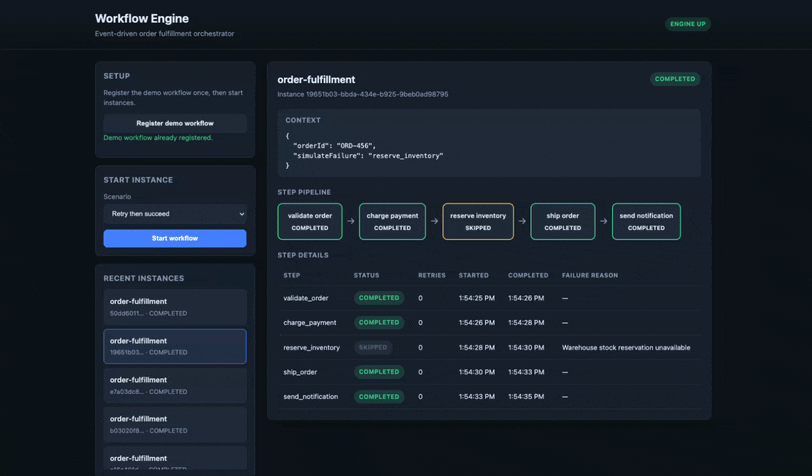
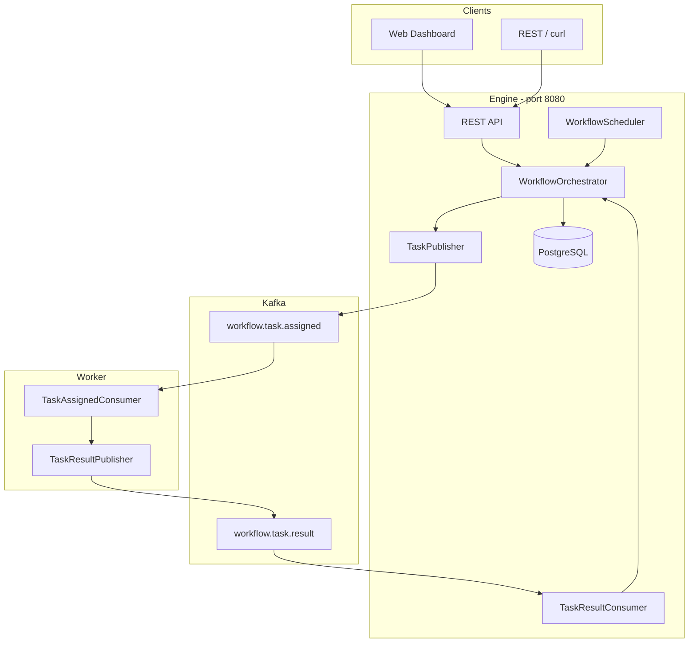

# Workflow Engine

Event-driven workflow orchestration system built with Java, Spring Boot, PostgreSQL, and Kafka. The engine owns workflow state and dispatches work to stateless workers; workers execute steps and report results asynchronously.

## Live Demo



## Documentation

| Document | Description |
|----------|-------------|
| [Architecture Overview](docs/ARCHITECTURE.md) | Full system design, data model, state machines, message flows |
| [Engine Module](engine/README.md) | Orchestrator, REST API, Kafka integration, scheduler |
| [Worker Module](worker/README.md) | Task consumer, execution logic, result publishing |
| [Infrastructure](infra/README.md) | PostgreSQL, Kafka, Docker Compose setup |
| [Live Demo Guide](DEMO.md) | Five-minute dashboard and API walkthrough |

## Architecture at a Glance



**Core principle:** PostgreSQL is the source of truth for workflow state. Kafka is the async transport between engine and workers.

## Quick Start

### Prerequisites

- Java 17+
- Docker and Docker Compose

### Run the system

```bash
# 1. Infrastructure
cd infra && docker compose up -d

# 2. Engine (port 8080)
cd engine && ./mvnw spring-boot:run

# 3. Worker
cd worker && ../engine/mvnw spring-boot:run

# 4. Open dashboard
open http://localhost:8080
```

If Flyway fails on startup (stale schema), reset the database:

```bash
cd infra && docker compose down -v && docker compose up -d
```

### Run all demo scenarios

```bash
chmod +x scripts/demo.sh
./scripts/demo.sh
```

For a detailed walkthrough of the dashboard, failure handling, and retry flow, see [DEMO.md](DEMO.md).

## Configuration and Secrets

The committed Docker credentials (`workflow` / `workflow`) are intentionally local-only defaults for the disposable demo database; they grant access only to the Docker container on your machine and are not production credentials. Real credentials are supplied through `DB_USERNAME`, `DB_PASSWORD`, and `KAFKA_BOOTSTRAP_SERVERS` environment variables.

`.env`, local Spring profile files, certificate files, keystores, and credential exports are ignored by Git. Do not commit any real cloud, database, or API credentials.

## Demo Workflow: Order Fulfillment

| Step | Critical | Behavior on failure |
|------|----------|---------------------|
| `validate_order` | Yes | Retry, then fail workflow |
| `charge_payment` | Yes | Retry, then fail workflow |
| `reserve_inventory` | No | Skip and continue |
| `ship_order` | Yes | Retry, then fail workflow |
| `send_notification` | No | Skip and continue |

## API

| Method | Path | Description |
|--------|------|-------------|
| GET | `/` | Web dashboard |
| GET | `/api/workflows` | List workflow definitions |
| POST | `/api/workflows` | Register a workflow definition |
| POST | `/api/workflows/{name}/instances` | Start a workflow instance |
| GET | `/api/instances` | List recent instances |
| GET | `/api/instances/{id}` | Get instance status and step history |
| GET | `/actuator/health` | Health check |

## Project Structure

```
workflow-engine/
├── docs/
│   └── ARCHITECTURE.md      # Full system architecture
├── engine/                  # Orchestration service (port 8080)
│   ├── README.md
│   └── src/main/resources/static/   # Web dashboard
├── worker/                  # Task executor service
│   └── README.md
├── infra/                   # Docker Compose (Postgres + Kafka)
│   └── README.md
├── scripts/
│   └── demo.sh              # End-to-end demo script
└── README.md                # This file
```

## Design Highlights

- **Separation of orchestration and execution** — engine manages state; workers are stateless and horizontally scalable
- **Transactional outbox** — state changes and task assignments commit together; an outbox dispatcher retries undelivered Kafka sends
- **At-least-once Kafka delivery** — handled via step status guards and idempotency keys
- **Per-step policies** — `maxRetries`, `timeoutSeconds`, and `critical` flag drive failure behavior
- **Polling scheduler** — retries and timeouts detected every 10 seconds
- **Observable execution** — structured logs with MDC fields; Actuator health endpoint
- **Extensible worker execution** — `WorkflowTaskHandler` cleanly separates demo behavior from real payment, inventory, or shipping integrations
- **Continuous integration** — GitHub Actions validates both Spring Boot modules on every push and pull request
- **Database integration coverage** — Testcontainers verifies Flyway migrations against real PostgreSQL in Docker-capable environments

## Tech Stack

| Layer | Technology |
|-------|------------|
| Language | Java 17 |
| Framework | Spring Boot 4 |
| Database | PostgreSQL 16 |
| Messaging | Apache Kafka (Confluent 7.6) |
| Schema migration | Flyway |
| Build | Maven |