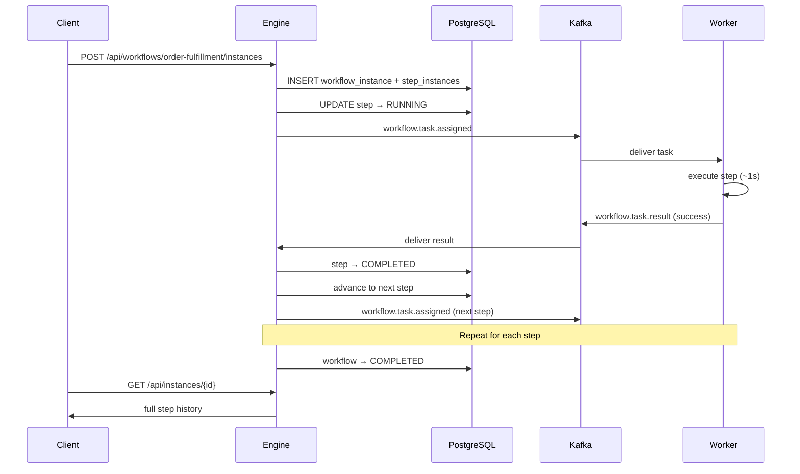
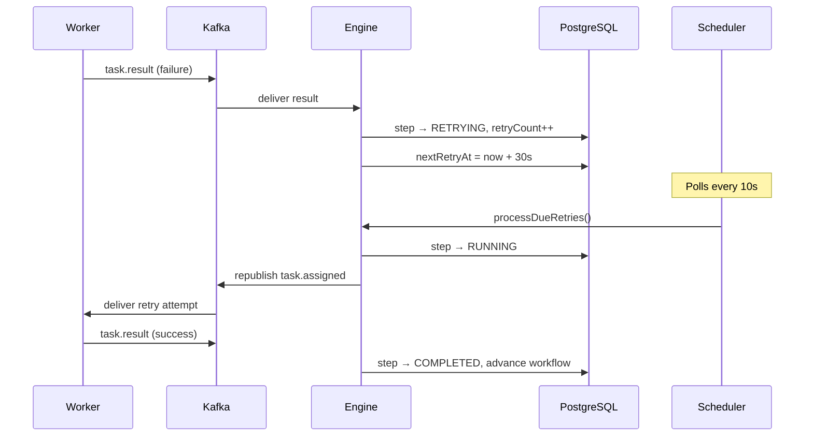
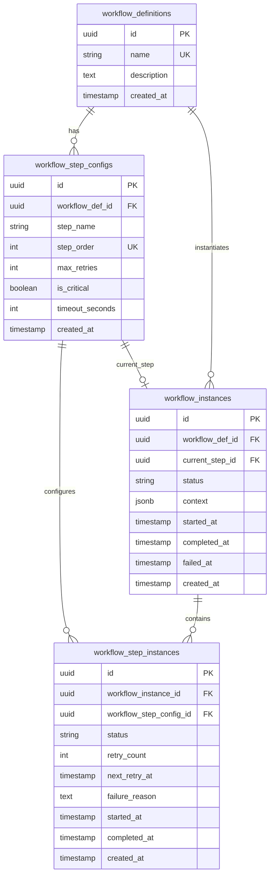
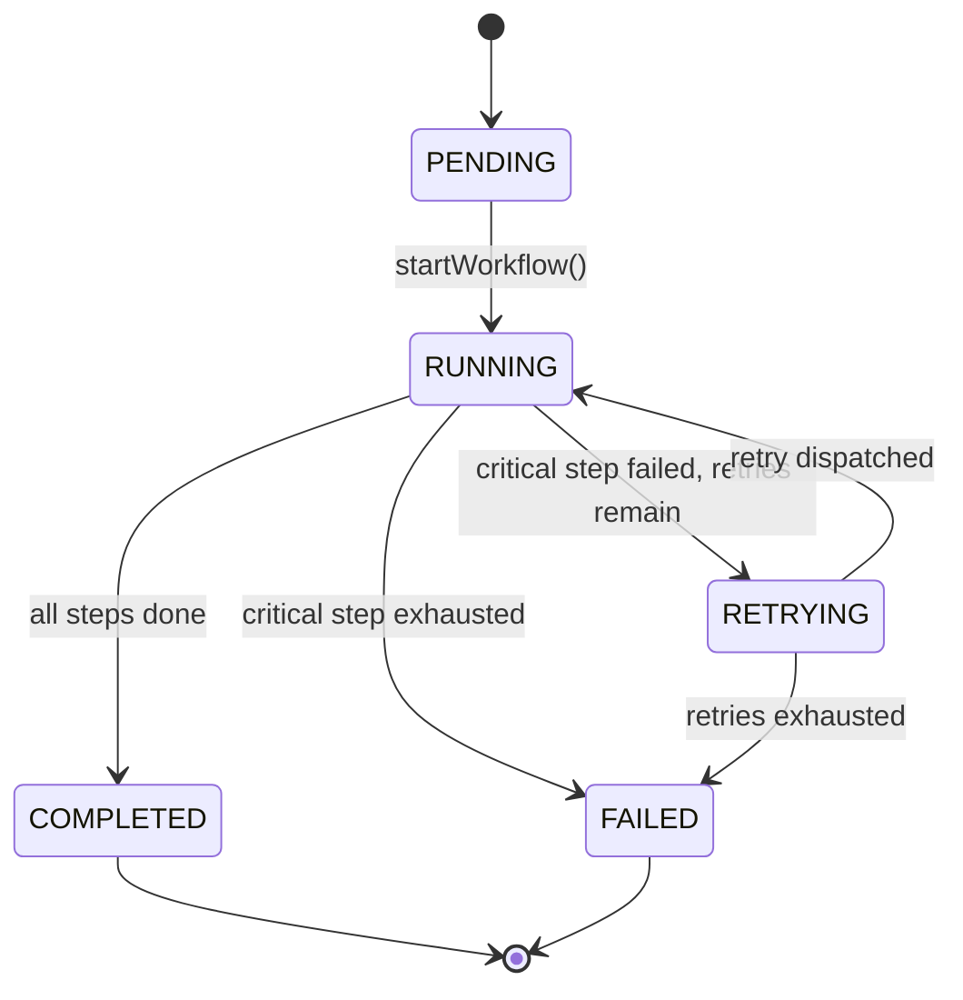
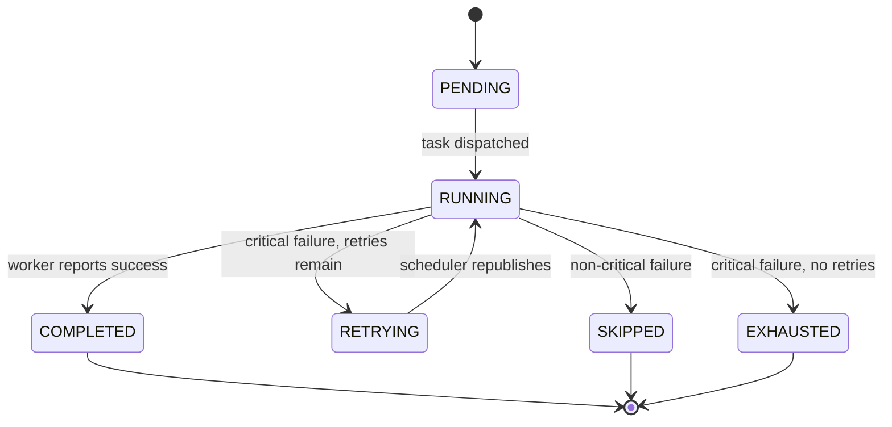
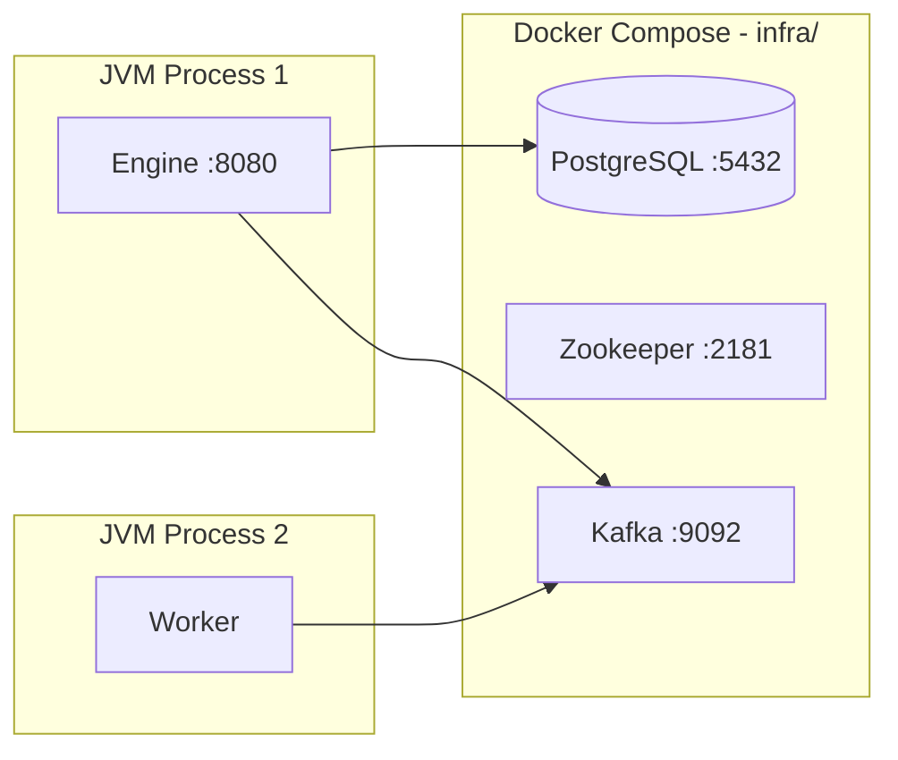

# System Architecture

This document describes the full architecture of the Workflow Engine: components, data model, state machines, message flows, and reliability patterns.

## Table of Contents

1. [System Overview](#system-overview)
2. [Component Responsibilities](#component-responsibilities)
3. [End-to-End Flow](#end-to-end-flow)
4. [Data Model](#data-model)
5. [State Machines](#state-machines)
6. [Kafka Messaging](#kafka-messaging)
7. [Reliability Patterns](#reliability-patterns)
8. [Scheduler](#scheduler)
9. [Web Dashboard](#web-dashboard)
10. [Deployment Topology](#deployment-topology)
11. [Design Decisions](#design-decisions)
12. [Future Improvements](#future-improvements)

---

## System Overview

The Workflow Engine is an **event-driven orchestrator** for multi-step business processes. It follows a classic **orchestrator + worker** pattern:

- The **engine** is stateful: it persists workflow definitions and runtime state, decides what step runs next, and handles failures.
- **Workers** are stateless executors: they receive a task, perform work, and publish a result. They have no knowledge of the overall workflow graph.

This separation allows independent scaling, failure isolation, and swapping worker implementations per step type.

```mermaid
C4Context
    title System Context

    Person(user, "User / Recruiter", "Starts workflows, views dashboard")
    System(engine, "Workflow Engine", "Orchestrates steps, owns state")
    System_Ext(worker, "Worker Service", "Executes individual steps")
    SystemDb(db, "PostgreSQL", "Workflow state")
    System_Ext(kafka, "Kafka", "Async task transport")

    user --> engine : REST / Dashboard
    engine --> db : Read/write state
    engine --> kafka : Publish tasks
    kafka --> worker : Deliver tasks
    worker --> kafka : Publish results
    kafka --> engine : Deliver results
```

---

## Component Responsibilities

### Engine (`engine/`)

| Package / Component | Responsibility |
|---------------------|----------------|
| `api/` | REST controllers, DTOs, global exception handler |
| `service/WorkflowService` | Register workflow definitions |
| `service/WorkflowOrchestrator` | Core state machine: start, advance, fail, retry |
| `service/WorkflowInstanceService` | Instance queries and list |
| `service/WorkflowScheduler` | Poll for due retries and timeouts |
| `service/OutboxService` + `service/OutboxDispatcher` | Persist task assignments atomically, then reliably deliver committed outbox records to Kafka |
| `kafka/TaskPublisher` | Deliver committed outbox records to Kafka |
| `kafka/TaskResultConsumer` | Consume `TaskResultMessage`, delegate to orchestrator |
| `domain/` | JPA entities and status enums |
| `repository/` | Spring Data JPA repositories |
| `resources/static/` | Web dashboard (HTML/CSS/JS) |

### Worker (`worker/`)

| Component | Responsibility |
|-----------|----------------|
| `TaskAssignedConsumer` | Consume assigned tasks, simulate execution |
| `TaskResultPublisher` | Publish success/failure results |
| `WorkerProperties` | Kafka topic names, processing delay |

### Infrastructure (`infra/`)

| Service | Responsibility |
|---------|----------------|
| PostgreSQL 16 | Persistent workflow state |
| Zookeeper | Kafka coordination |
| Kafka | Message broker between engine and worker |

---

## End-to-End Flow

### Sequence: Happy Path



### Sequence: Critical Step Failure with Retry



---

## Data Model

The schema separates **definitions** (blueprints) from **instances** (runtime executions).



### Entity Relationships

| Entity | Purpose |
|--------|---------|
| `WorkflowDefinition` | Named workflow template (e.g. `order-fulfillment`) |
| `WorkflowStepConfig` | Ordered step blueprint with policy: retries, timeout, critical flag |
| `WorkflowInstance` | One execution of a definition; carries runtime `context` JSON |
| `WorkflowStepInstance` | Runtime state for a single step within an instance |

### Context JSON

Each instance carries a `context` blob passed to every worker via Kafka:

```json
{
  "orderId": "ORD-123",
  "amount": 99.99,
  "simulateFailure": "charge_payment"
}
```

Workers read `simulateFailure` in the demo to trigger controlled failures.

---

## State Machines

### Workflow Status



| Status | Meaning |
|--------|---------|
| `PENDING` | Created but not yet started (default) |
| `RUNNING` | Actively executing a step |
| `RETRYING` | Waiting to retry a failed critical step |
| `COMPLETED` | All steps finished successfully |
| `FAILED` | A critical step exhausted retries |
| `PAUSED` | Reserved for future human-approval flows |

### Step Status



### Failure Handling Logic

```
On step failure:
├── non-critical step → SKIPPED → advance to next step
└── critical step
    ├── retryCount < maxRetries → RETRYING → schedule republish
    └── retryCount >= maxRetries → EXHAUSTED → workflow FAILED
```

---

## Kafka Messaging

### Topics

| Topic | Producer | Consumer | Payload |
|-------|----------|----------|---------|
| `workflow.task.assigned` | Engine | Worker | `TaskAssignedMessage` |
| `workflow.task.result` | Worker | Engine | `TaskResultMessage` |

### Message Schemas

**TaskAssignedMessage** (engine → worker):

```json
{
  "idempotencyKey": "stepInstanceId:retryCount",
  "workflowInstanceId": "uuid",
  "stepInstanceId": "uuid",
  "stepName": "charge_payment",
  "retryCount": 0,
  "context": "{\"orderId\":\"ORD-123\"}"
}
```

**TaskResultMessage** (worker → engine):

```json
{
  "idempotencyKey": "stepInstanceId:retryCount",
  "workflowInstanceId": "uuid",
  "stepInstanceId": "uuid",
  "stepName": "charge_payment",
  "success": false,
  "failureReason": "Simulated failure for step charge_payment",
  "retryCount": 0
}
```

### Consumer Groups

| Service | Group ID | Purpose |
|---------|----------|---------|
| Engine | `workflow-engine` | Consumes task results |
| Worker | `workflow-worker` | Consumes assigned tasks |

---

## Reliability Patterns

### Idempotency

Kafka delivers messages **at least once**. Duplicate results are ignored in `WorkflowOrchestrator.handleTaskResult()`:

```java
if (stepInstance.getStatus() != StepStatus.RUNNING) {
    return; // ignore duplicate
}
```

The idempotency key `{stepInstanceId}:{retryCount}` uniquely identifies each logical attempt.

### Transactional Outbox

When the engine dispatches a step, it writes an `outbox_events` row in the same database transaction as the workflow state transition. `OutboxDispatcher` polls committed records and marks a row published only after Kafka acknowledges the send. This prevents lost assignments if the engine stops between committing state and contacting Kafka.

The remaining delivery edge case is deliberate at-least-once behavior: a crash after Kafka acknowledges but before `published_at` is stored may resend the message. Workers use the idempotency key above to make that safe.

### Retry Policy

- Configured per step via `maxRetries` on `WorkflowStepConfig`
- On critical failure: increment `retryCount`, set `nextRetryAt = now + 30s`
- `WorkflowScheduler` republishes due retries every 10 seconds

### Timeout Detection

- `WorkflowScheduler` finds steps in `RUNNING` where `startedAt + timeoutSeconds < now`
- Timeout is treated as a failure (same retry/fail path as worker-reported failure)

### Non-Critical Skip

Non-critical steps (e.g. `reserve_inventory`, `send_notification`) are marked `SKIPPED` on failure and the workflow continues. This models real-world tolerance for best-effort steps.

---

## Scheduler

`WorkflowScheduler` runs every **10 seconds** (`workflow.scheduler.fixed-delay-ms`):

1. **`processDueRetries()`** — finds steps in `RETRYING` where `nextRetryAt <= now`, republishes to Kafka
2. **`processTimeouts()`** — finds steps in `RUNNING` past their deadline, triggers failure handling

This is a polling-based approach suitable for an MVP. At scale, consider Kafka delayed messages, Redis sorted sets, or a dedicated scheduler like Temporal.

---

## Web Dashboard

Served as static files from `engine/src/main/resources/static/` at `http://localhost:8080`.

| Feature | Implementation |
|---------|----------------|
| Register demo workflow | `POST /api/workflows` |
| Start instance | `POST /api/workflows/{name}/instances` |
| Live step pipeline | Polls `GET /api/instances/{id}` every 2s |
| Instance list | `GET /api/instances` |
| Health indicator | `GET /actuator/health` |

Step cards are color-coded: pending (gray), running (blue pulse), completed (green), skipped (yellow), retrying (orange), failed (red).

---

## Deployment Topology



All services run locally for development. The engine and worker are separate Spring Boot applications that can be scaled independently in production.

---

## Design Decisions

| Decision | Rationale | Tradeoff |
|----------|-----------|----------|
| PostgreSQL for state | ACID transactions, queryable status API | Not as fast as in-memory for high throughput |
| Kafka for dispatch | Decouples engine from workers, buffers load | Adds operational complexity vs direct HTTP |
| Linear step order | Simple to implement and demo | No branching, parallel steps, or DAGs |
| Polling scheduler | Fast to build, no extra infra | Less precise than event-driven timers |
| JSON context blob | Flexible, worker-specific logic | No schema validation on context |
| Separate worker module | Independent scaling and deployment | Duplicate Kafka DTOs between modules |
| Static web dashboard | Zero frontend build step | Limited interactivity vs React SPA |

---

## Future Improvements

Production-grade enhancements not in scope for the MVP:

1. **Dead letter queue** — handle poison messages
2. **Saga compensation** — rollback on failure (e.g. refund payment)
3. **Branching / parallel steps** — DAG-based workflows
4. **Human approval** — `PAUSED` status with resume API
5. **OpenTelemetry tracing** — end-to-end request tracing
6. **Prometheus metrics** — step duration, retry rate, failure rate
7. **Auth and multi-tenancy** — isolate workflows per tenant
8. **Schema registry** — Avro/Protobuf for Kafka messages
9. **Dedicated timer infrastructure** — replace polling scheduler

See [INTERVIEW.md](../INTERVIEW.md) for how to discuss these in interviews.
