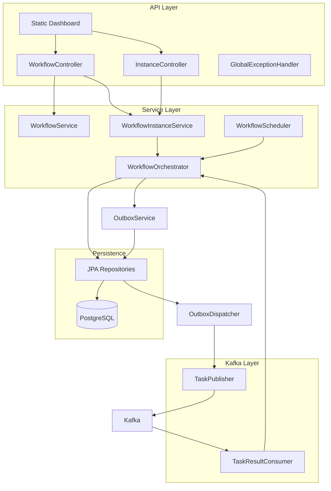

# Engine Module

The engine is the **orchestration brain** of the Workflow Engine. It owns all workflow state in PostgreSQL, exposes a REST API and web dashboard, publishes tasks to Kafka, and consumes worker results to advance workflows.

**Port:** 8080  
**Tech:** Spring Boot 4, Spring Data JPA, Spring Kafka, Flyway, Actuator

## Architecture



## Package Structure

```
com.workflow.engine/
├── EngineApplication.java          # @SpringBootApplication + @EnableScheduling
├── api/
│   ├── WorkflowController.java     # POST/GET /api/workflows
│   ├── InstanceController.java     # GET /api/instances
│   ├── GlobalExceptionHandler.java # 409 for duplicate workflows
│   └── dto/                        # Request/response objects
├── config/
│   ├── WorkflowProperties.java     # Kafka topics, retry delay
│   └── JacksonConfig.java          # ObjectMapper bean
├── domain/                         # JPA entities + enums
├── kafka/
│   ├── TaskPublisher.java          # Delivers committed outbox records to Kafka
│   ├── TaskResultConsumer.java     # Consumes workflow.task.result
│   └── dto/                        # Kafka message schemas
├── repository/                     # Spring Data JPA
└── service/
    ├── WorkflowService.java        # Definition registration
    ├── WorkflowInstanceService.java # Instance queries
    ├── WorkflowOrchestrator.java   # Core state machine
    └── WorkflowScheduler.java      # Retry + timeout polling
```

## Core Components

### WorkflowOrchestrator

The central state machine. Key methods:

| Method | Trigger | Action |
|--------|---------|--------|
| `startWorkflow()` | API: start instance | Create instance + steps, dispatch first task |
| `handleTaskResult()` | Kafka: task result | Complete, fail, skip, or retry step |
| `advanceWorkflow()` | Internal | Move to next step or mark workflow COMPLETED |
| `handleStepFailure()` | Internal | Apply retry/skip/fail policy |
| `processDueRetries()` | Scheduler | Republish RETRYING steps past `nextRetryAt` |
| `processTimeouts()` | Scheduler | Fail RUNNING steps past `timeoutSeconds` |
| `dispatchExistingStep()` | Internal | Mark RUNNING, enqueue task assignment |

All state transitions happen inside `@Transactional` methods.

### WorkflowScheduler

Runs every 10 seconds via `@Scheduled`. Calls:

1. `orchestrator.processDueRetries()`
2. `orchestrator.processTimeouts()`

### Transactional Outbox and Kafka Integration

**OutboxService** serializes each `TaskAssignedMessage` and stores it with the workflow state transition. **OutboxDispatcher** polls committed rows and uses **TaskPublisher** to deliver them to `workflow.task.assigned`; a row is marked published only after Kafka acknowledges the write. The workflow instance ID is the Kafka key, preserving ordering for one workflow.

**TaskResultConsumer** listens on `workflow.task.result`, deserializes `TaskResultMessage`, and delegates to `WorkflowOrchestrator.handleTaskResult()`. Sets MDC fields for structured logging.

## REST API

| Method | Path | Handler |
|--------|------|---------|
| GET | `/api/workflows` | List definitions |
| POST | `/api/workflows` | Register definition |
| POST | `/api/workflows/{name}/instances` | Start instance |
| GET | `/api/instances` | List recent instances (top 50) |
| GET | `/api/instances/{id}` | Full instance with step history |
| GET | `/actuator/health` | Health check |
| GET | `/` | Web dashboard |

## Database

Schema managed by Flyway migration `V1__init.sql`. Hibernate validates against it (`ddl-auto=validate`).

See [docs/ARCHITECTURE.md](../docs/ARCHITECTURE.md#data-model) for the full ER diagram.

## Configuration

Key properties in `application.properties`:

| Property | Default | Description |
|----------|---------|-------------|
| `spring.datasource.url` | `jdbc:postgresql://localhost:5432/workflow_db` | Database connection |
| `spring.kafka.bootstrap-servers` | `localhost:9092` | Kafka broker |
| `workflow.kafka.topic.task-assigned` | `workflow.task.assigned` | Outbound topic |
| `workflow.kafka.topic.task-result` | `workflow.task.result` | Inbound topic |
| `workflow.retry-delay-seconds` | `30` | Delay before retry republish |
| `workflow.scheduler.fixed-delay-ms` | `10000` | Scheduler poll interval |
| `workflow.outbox.fixed-delay-ms` | `1000` | Outbox delivery poll interval |

## Web Dashboard

Static files in `src/main/resources/static/`:

- `index.html` — layout and controls
- `css/styles.css` — dark theme, pipeline visualization
- `js/app.js` — API calls, auto-polling, step rendering

No build step required; served directly by Spring Boot.

## Running

```bash
cd engine
./mvnw spring-boot:run
```

Requires PostgreSQL and Kafka running (see [infra/README.md](../infra/README.md)).

## Testing

```bash
./mvnw test
```

Uses an H2-backed Spring context test without requiring a local Kafka broker. A Testcontainers integration test runs Flyway against PostgreSQL when Docker is available, including in GitHub Actions.
