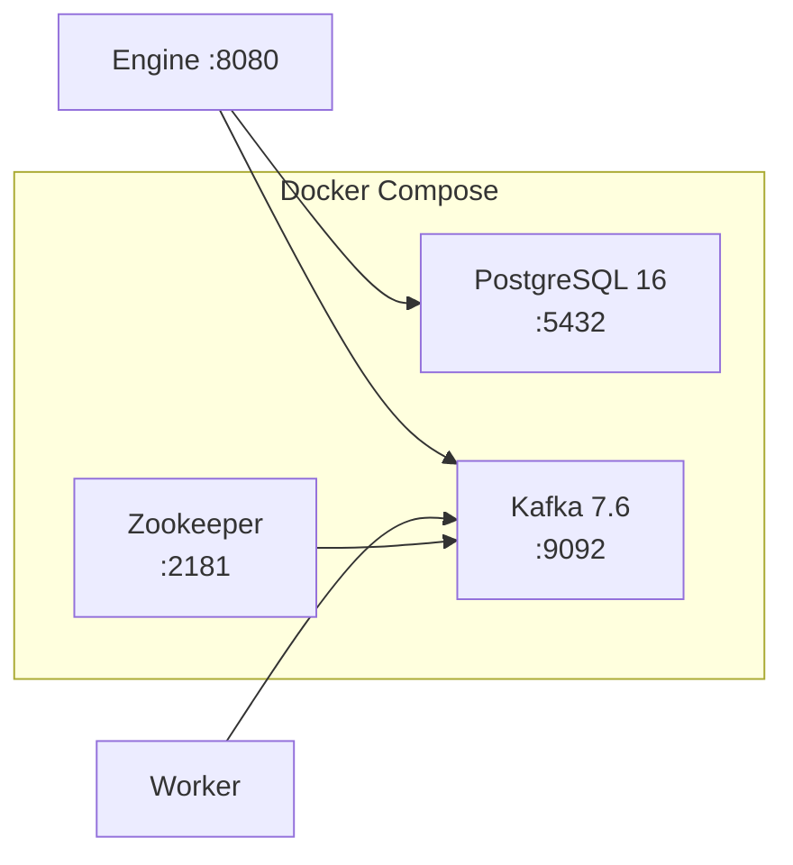

# Infrastructure

Local development infrastructure for the Workflow Engine, managed via Docker Compose.

## Services



| Service | Image | Port | Purpose |
|---------|-------|------|---------|
| PostgreSQL | `postgres:16` | 5432 | Workflow state persistence |
| Zookeeper | `confluentinc/cp-zookeeper:7.6.0` | 2181 | Kafka cluster coordination |
| Kafka | `confluentinc/cp-kafka:7.6.0` | 9092 | Async message broker |

## Files

```
infra/
├── docker-compose.yml    # Service definitions
└── init.sql              # PostgreSQL user/database bootstrap
```

### docker-compose.yml

Defines three services with a named volume (`postgres_data`) for PostgreSQL data persistence. Kafka is configured with:

- Single broker (development only)
- `KAFKA_AUTO_CREATE_TOPICS_ENABLE=true` — topics created on first publish
- `KAFKA_ADVERTISED_LISTENERS=PLAINTEXT://localhost:9092` — accessible from host

### init.sql

Runs once on first PostgreSQL startup. Creates the `workflow` user and grants privileges on `workflow_db`. Table schema is managed by Flyway in the engine module, not by this script.

## Usage

### Start all services

```bash
cd infra
docker compose up -d
```

### Check status

```bash
docker compose ps
```

### View logs

```bash
docker compose logs -f kafka
docker compose logs -f postgres
```

### Stop services

```bash
docker compose down
```

### Reset database (clean slate)

Removes the PostgreSQL volume. Required if Flyway migration fails due to stale schema:

```bash
docker compose down -v
docker compose up -d
```

## Connection Details

Used by the engine (`engine/src/main/resources/application.properties`):

| Setting | Value |
|---------|-------|
| JDBC URL | `jdbc:postgresql://localhost:5432/workflow_db` |
| Username | `workflow` |
| Password | `workflow` |

Used by engine and worker for Kafka:

| Setting | Value |
|---------|-------|
| Bootstrap servers | `localhost:9092` |

## Kafka Topics

Topics are auto-created when the engine or worker first publishes. No manual topic creation is needed for local development.

| Topic | Created by |
|-------|-----------|
| `workflow.task.assigned` | Engine (TaskPublisher) |
| `workflow.task.result` | Worker (TaskResultPublisher) |

### Inspect topics (optional)

```bash
docker exec infra-kafka-1 kafka-topics --bootstrap-server localhost:9092 --list

docker exec infra-kafka-1 kafka-console-consumer \
  --bootstrap-server localhost:9092 \
  --topic workflow.task.assigned \
  --from-beginning
```

## Troubleshooting

| Problem | Solution |
|---------|----------|
| `Connection refused` on 5432 | Run `docker compose up -d` and wait for Postgres |
| `Connection refused` on 9092 | Wait ~10s after starting; Kafka needs Zookeeper first |
| Flyway baseline error | Run `docker compose down -v && docker compose up -d` |
| Port already in use | Stop conflicting services or change ports in `docker-compose.yml` |
| Kafka consumer disconnects | Restart Kafka after volume reset: `docker compose restart kafka` |

## Production Considerations

This setup is for **local development only**. Production would require:

- Managed PostgreSQL (RDS, Cloud SQL) with backups and replication
- Managed Kafka (Confluent Cloud, MSK) with multiple brokers
- TLS encryption for database and Kafka connections
- Secrets management instead of plaintext passwords
- Health checks and resource limits in container definitions
- Separate networks and firewall rules
