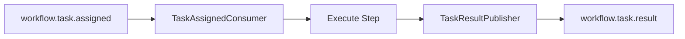
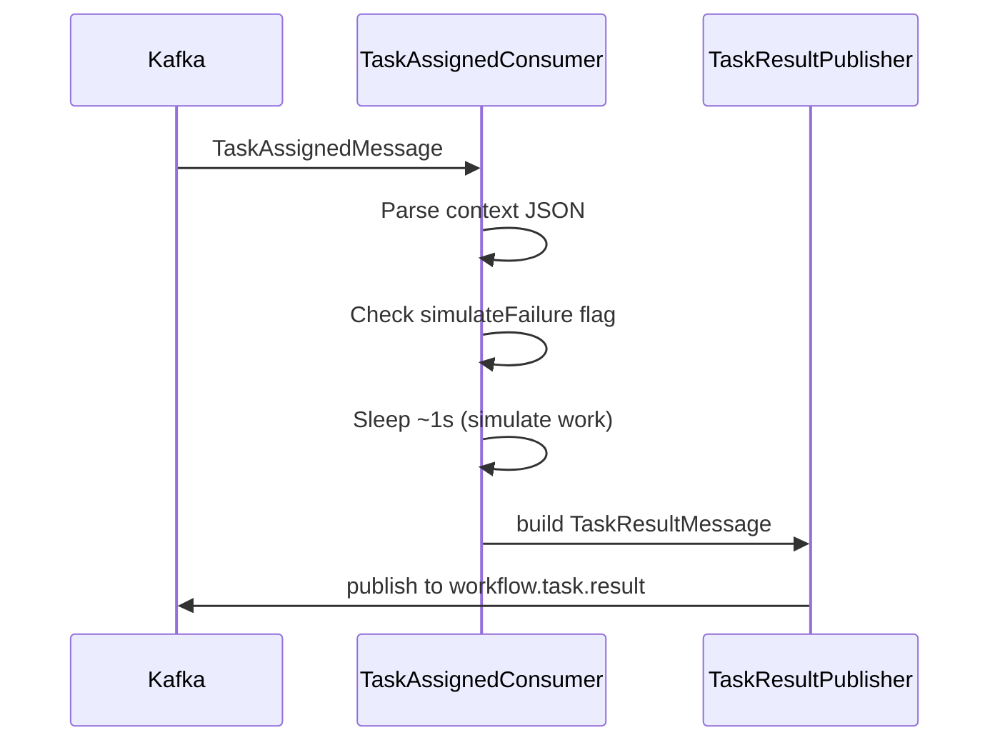

# Worker Module

The worker is a **stateless task executor**. It consumes assigned tasks from Kafka, performs work, and publishes results back. It has no database and no knowledge of the overall workflow graph.

**Tech:** Spring Boot 4, Spring Kafka

## Architecture



## Package Structure

```
com.workflow.worker/
├── WorkerApplication.java
├── config/
│   ├── WorkerProperties.java    # Topic names, processing delay
│   └── JacksonConfig.java       # ObjectMapper bean
└── kafka/
    ├── TaskAssignedConsumer.java  # Inbound: consume assigned tasks
    ├── TaskResultPublisher.java # Outbound: publish results
    └── dto/
        ├── TaskAssignedMessage.java
        └── TaskResultMessage.java
```

## Execution Flow



### Step handlers

`WorkflowTaskHandler` is the extension point for production execution. The included `SimulatedTaskHandler` supports every step and makes the local demo deterministic. Add a handler that supports a specific `stepName` to call a real service; for example, a payment handler can support `charge_payment` and invoke a payment provider.

### TaskAssignedConsumer

1. Deserialize `TaskAssignedMessage` from Kafka
2. Parse `context` JSON
3. Select a registered `WorkflowTaskHandler`
4. Publish its `TaskExecutionResult` with the same `idempotencyKey`

The demo handler fails a `simulateFailure` step only when `retryCount == 0`, then succeeds on retry.

The `retryCount == 0` check ensures the retry demo works: first attempt fails, retry succeeds.

### TaskResultPublisher

Serializes `TaskResultMessage` to JSON and publishes to `workflow.task.result`. Message key is `stepInstanceId`.

## Kafka DTOs

DTOs are duplicated from the engine module (no shared library) to keep modules independent.

**TaskAssignedMessage** (inbound):

| Field | Type | Description |
|-------|------|-------------|
| `idempotencyKey` | String | `{stepInstanceId}:{retryCount}` |
| `workflowInstanceId` | UUID | Parent workflow instance |
| `stepInstanceId` | UUID | This step's runtime ID |
| `stepName` | String | e.g. `charge_payment` |
| `retryCount` | int | Current retry attempt |
| `context` | String | JSON blob from workflow instance |

**TaskResultMessage** (outbound):

| Field | Type | Description |
|-------|------|-------------|
| `idempotencyKey` | String | Same as assigned message |
| `workflowInstanceId` | UUID | Parent workflow instance |
| `stepInstanceId` | UUID | This step's runtime ID |
| `stepName` | String | Step that was executed |
| `success` | boolean | Whether step succeeded |
| `failureReason` | String | Reason if failed |
| `retryCount` | int | Retry attempt number |

## Configuration

Properties in `application.properties`:

| Property | Default | Description |
|----------|---------|-------------|
| `spring.kafka.bootstrap-servers` | `localhost:9092` | Kafka broker |
| `spring.kafka.consumer.group-id` | `workflow-worker` | Consumer group |
| `workflow.kafka.topic.task-assigned` | `workflow.task.assigned` | Inbound topic |
| `workflow.kafka.topic.task-result` | `workflow.task.result` | Outbound topic |
| `workflow.processing-delay-ms` | `1000` | Simulated work duration |

## Scaling

Workers are horizontally scalable. Run multiple worker instances with the same consumer group (`workflow-worker`); Kafka distributes partitions across them.

In production, you would deploy **different worker types** per step (payment worker, shipping worker) by filtering on `stepName` or using separate Kafka topics per step type.

## Running

```bash
cd worker
../engine/mvnw spring-boot:run
```

Requires Kafka running (see [infra/README.md](../infra/README.md)). The worker does not need PostgreSQL.

## Testing

```bash
../engine/mvnw test
```

Uses a broker-free Spring context test so the build is runnable without local infrastructure.

## Replacing the Demo Worker

To connect real business logic, add a step-specific handler:

```java
@Component
class PaymentTaskHandler implements WorkflowTaskHandler {
    public boolean supports(String stepName) {
        return "charge_payment".equals(stepName);
    }

    public TaskExecutionResult execute(TaskAssignedMessage task) {
        paymentService.charge(/* read task context */);
        return TaskExecutionResult.succeeded();
    }
}
```

The worker contract remains the same: consume `TaskAssignedMessage`, publish `TaskResultMessage`.
